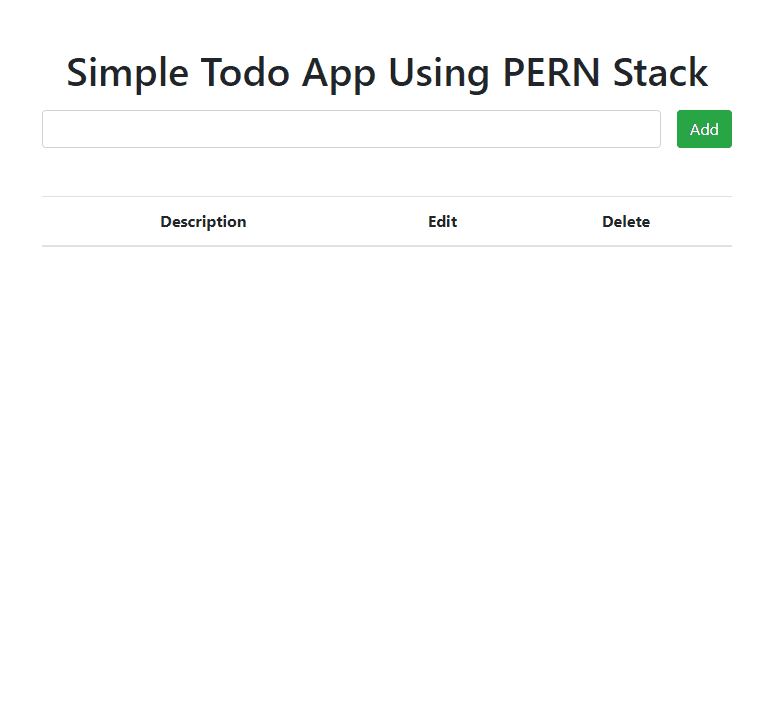

# Simple Todo App With PERN Stack

- React.js
- PostgreSQL
- Express.js
- Node.js
- Bootstrap

## Instructions

1. Clone Repo
2. Run `npm install`
3. Create `.env` file and assign your Postgres password to the variable PG_PW in the file. You should have set your password when setting up pg.
   ```
   PG_PW=YourPasswordHere
   ```
4. Open 2 terminals:
   - First terminal cd into server `npm run dev`
   - Second terminal cd into client run `npm start`

## Demo


